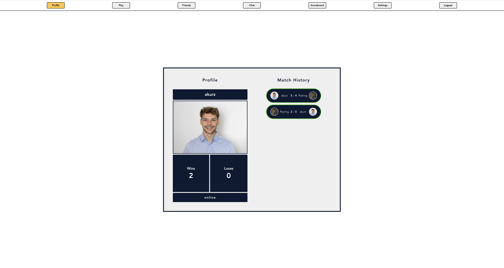
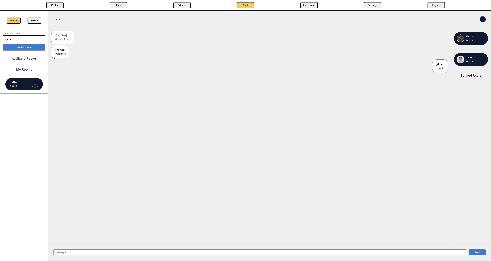
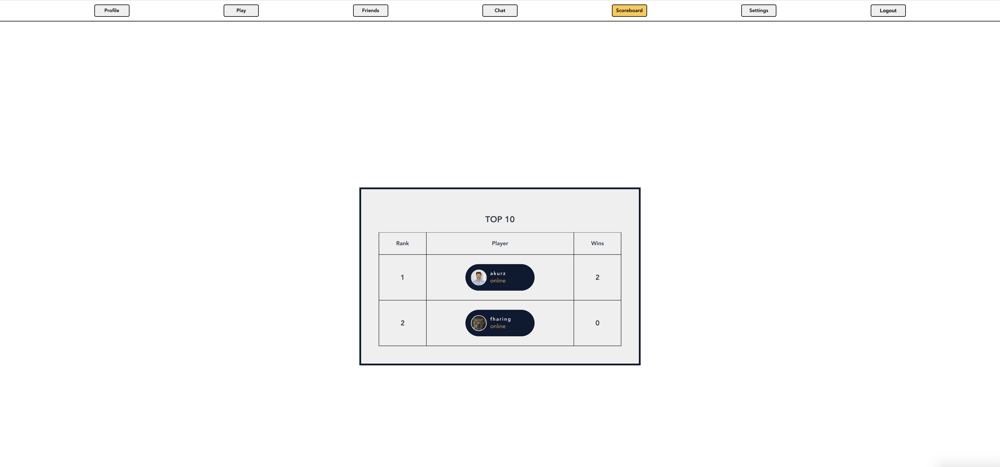
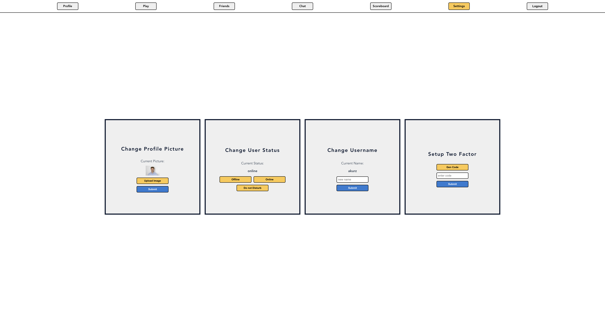

# ft_transcendence

## Final project of the 42 Core Curriculum

### Description
* Full stack Web Application
* Including online Pong Game with matchmaking system and game invitations
* Chat rooms and personal messages with ban, mute and admin options
* Friends and ability to block users
* A customizable Profile page
* Scoreboard and match history
* Two Factor Authentication


## Screenshots

### LoginView

### ProfileView

### GameView

### ChatView

### ScoreboardView

### SettingsView



## Setup

### Create the following .env files
* ./docker/db.env
```
POSTGRES_USER=trans
POSTGRES_PASSWORD=trans
POSTGRES_DB=transcendence
PGADMIN_DEFAULT_EMAIL=trans@trans.com
PGADMIN_DEFAULT_PASSWORD=admin
```

* ./backend/.env
```
DB_HOST='postgres'
DB_PORT=5432
DB_USERNAME='trans'
DB_PASSWORD='trans'
DB_NAME='transcendence'
TWO_FACTOR_AUTHENTICATION_APP_NAME='transcendence'
JWT_ACCESS_TOKEN_SECRET='secretllul'
JWT_ACCESS_TOKEN_EXPIRATION_TIME='2000'
JWT_REFRESH_TOKEN_SECRET='secretllul_2'
JWT_REFRESH_TOKEN_EXPIRATION_TIME='2000'
FORTYTWO_APP_ID='<UID_OF_YOUR_42_API_APP>'
FORTYTWO_APP_SECRET='<SECRET_OF_YOUR_42_API_APP>'
CALLBACK_URL='http://<HOST_URL>:3000/authentication/callback'
VUE_APP_HOST_URL='http://<HOST_URL>'
```

* ./frontend/.env
```
VUE_APP_HOST_URL='http://<HOST_URL>'
```

* Go to https://profile.intra.42.fr/oauth/applications and click 'Register a new app'
* In the field 'Redirect URI' put: http://<HOST_URL>:3000/authentication/callback

* Go to the root of the repository and run ```make```


## Resources
### Private Messaging
https://socket.io/get-started/private-messaging-part-1/

### Swagger UI
https://docs.nestjs.com/openapi/introduction

### TypeORM
https://typeorm.io/
https://docs.nestjs.com/recipes/sql-typeorm

### TypeORM relations
https://typeorm.io/relations

### VUE store
https://vuex.vuejs.org/guide/#the-simplest-store

### OAUTH flows
https://frontegg.com/blog/oauth-flows

### Authorization Roles
https://docs.nestjs.com/security/authorization

### Encryption and Hashing
https://docs.nestjs.com/security/encryption-and-hashing

### RXJS - Communication between components
https://rxjs.dev/guide/overview
https://jasonwatmore.com/post/2019/04/02/vuejs-rxjs-communicating-between-components-with-observable-subject

### Socket.io in Nest
https://docs.nestjs.com/websockets/gateways
https://socket.io/docs/v4/

### TypeOrm ManyToMany with extra properties
https://orkhan.gitbook.io/typeorm/docs/many-to-many-relations
